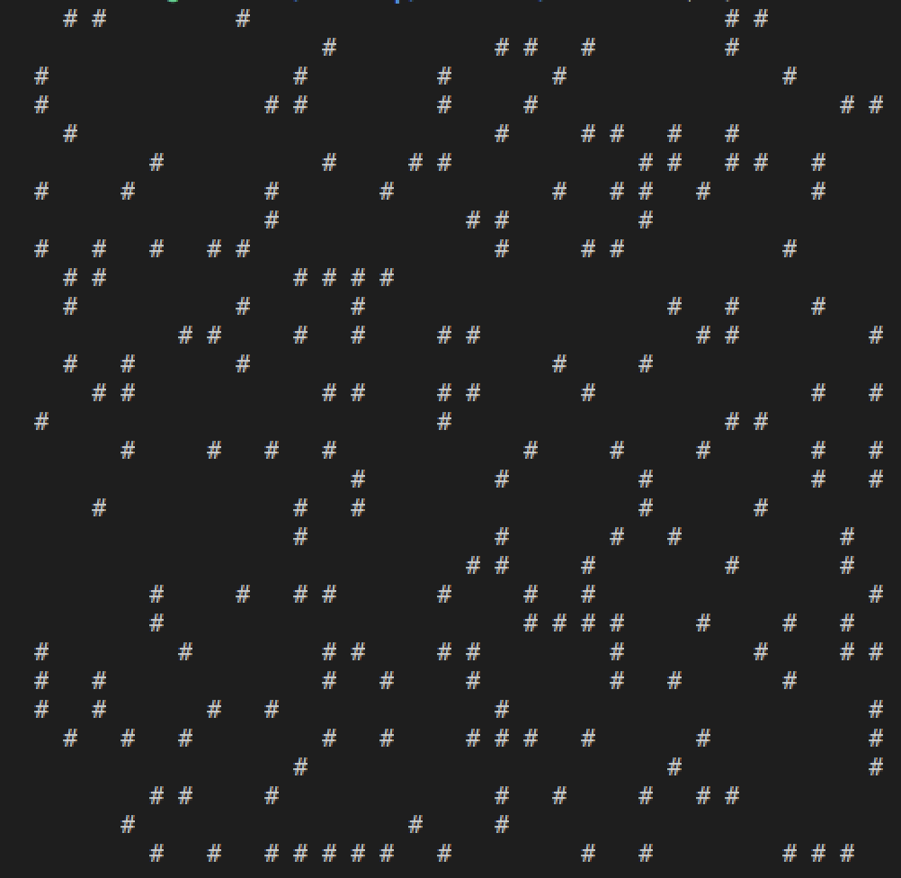
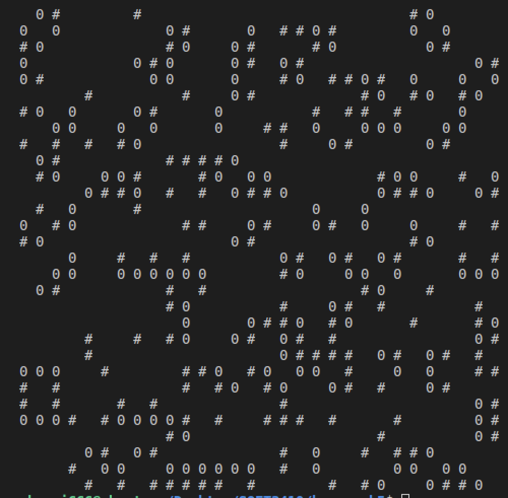
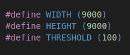
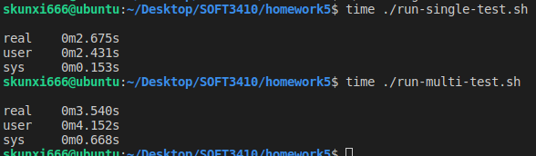

# How to run my test:  

There is a unit-test.sh file which will run my unit tests  

* Go to the unit-test.sh directory in terminal
* give permission to the file runTest.sh by:  
        chmod +x unit-test.sh
* run the file:  
        ./unit-test.sh

Use the same steps above to run performance test:  
There are multi-test.sh and single-test.sh files.  
You can use the following command to check performance.  
* time ./multi-test.sh  
* time ./single-test.sh  

# How do I make sure my program is correct
## test image
I did not use GIMP to genertae a image.c file. I used rand() function to generated a random image.

## unit testing
I have unit testing in test folder. It will check the step to generate the 1 bit image and the step to detect the contour line. However, the way to check the final image is kind naive and not efficient. I test it by checking the output image by print characters.

## check output by printf function
I  test the result by check the result manully. I test it by generating a small size image 30X30 in unit-tests.c file, and check the output value.  

Based on the result from small size image, I assume it is correct when the input is larger images.

**In the following example, the neg_color and pos_color are set as 2**. I display the countour line as '0', and the object as '#'    

Sample bit image generated by *msquare_1bit* 30x30: 

 

Sample output image generated by *msquare_fill* 30x30: 

 

By observe the sample output, it shows that my program is correct.

# Observation
## Performance
There are multi-thread-test.c and single-thread-test.c to check for thread performance. Both files use the same image size which has width as 9000, and height as 9000.  

 

To check the performance, use the 'time' tool in linux:

As it shows here, multi thread has longger time consumption, but it is not a extermely large difference. Consider it is a 9000x9000 size image, it is reasonable to have this time speed. Beyond that, there is no too much evidence to show there is any fasle sharing

